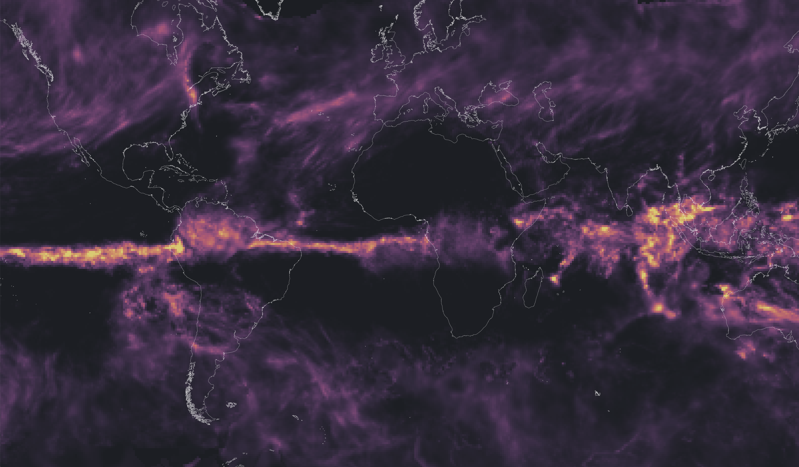

# Simple IMERG Zarr Demo

Built from [https://github.com/carbonplan/simple-map-demo](https://github.com/carbonplan/simple-map-demo) demo of using the [`@carbonplan/maps`](https://github.com/carbonplan/maps) library. 

Prequisites: nvm, npm, pip

# Steps

1. Create the COG
2. Create the Zarr from the COG
3. Run an http server for the Zarr (assuming local storage)
4. Run the next.js app to visualize the Zarr



## Step 1: Create the COG

Generated a COG using [cloud-optimized-data-pipelines: GPM IMERG example](https://github.com/NASA-IMPACT/cloud-optimized-data-pipelines/tree/main/docker/hdf5-to-cog#gpm-imerg-example)

## Step 2: Create the Zarr

Assumes you have copied the `tif` to `data/` in this project.

```bash
cd notebooks
pip install -r requirements.txt
jupyter notebook
```

Execute cells in `imerg-zarr-from-tif.ipynb`.

## Step 3: Run an http server for the Zarr (assuming local storage)

```bash
cd ../data
npm install http-server -g
http-server -p 8000 --cors
```

## Step 4: Run the next.js app to visualize the Zarr

Open a new terminal.

```bash
nvm use 12
npm i
npm run dev
```

# Todos

* Create the Zarr from the original NetCDF? (but if we're doing this for comparison with COGs, maybe this step we _should_ go from COG to Zarr 🤔).
* Look into additional features (time series generation)


